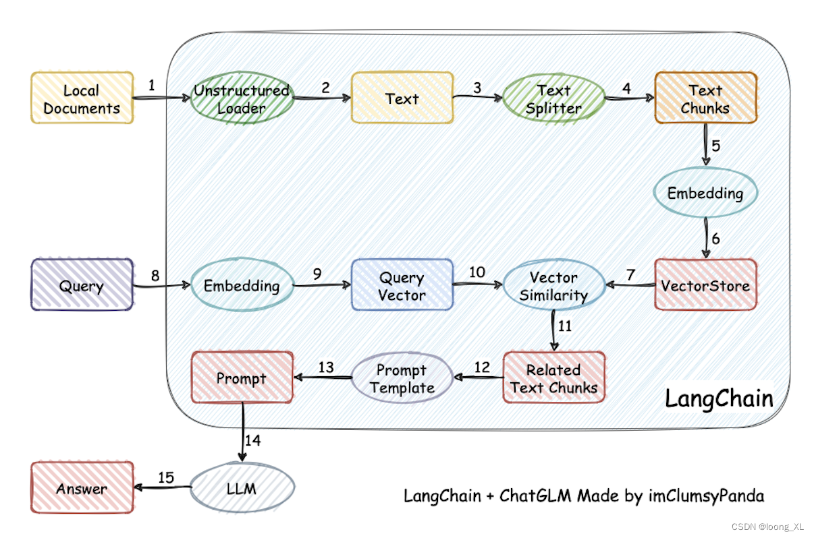

# my-llm-universe

本项目是学习 [llm-universe](https://github.com/datawhalechina/llm-universe) 的内容构建而成。

## RAG 功能

RAG 利用外部知识支撑，从而减少大模型的幻觉（hallucination）现象，提升回答的准确性。
RAG 的核心是向量数据库（Vector Database），它可以存储文本、图片等多模态数据，并支持高效的相似度检索。

## 任务

- [ ] 任务1：
- [ ] 任务2：
- [x] 任务3：搭建向量数据库
- [ ] 任务4：构建 RAG 应用
- [ ] 任务5：[个人知识库助手](task5.md)
